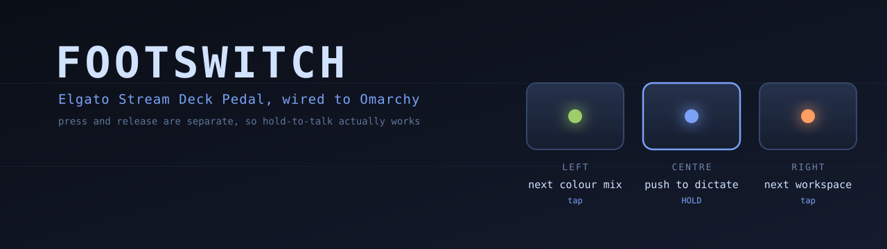

# footswitch



Elgato Stream Deck Pedal (0fd9:0086) wired to Omarchy.

Three switches, each acting on **press and release separately**. That split is
the whole reason a pedal beats a key binding: hold-to-talk is impossible on a
binding that only fires once.

## Layout

| pedal | action |
|---|---|
| **left** | tap: next workspace on this monitor |
| **centre** | **hold**: push to dictate (`voxtype record start` / `stop`) |
| **right** | tap: next track of whatever is playing (CLIAMP, Spotify, YouTube): sends MPRIS `Next` to the first player that is Playing, falling back to CLIAMP's IPC, then `omarchy-shell media next` |

Remap in `~/.config/footswitch.json`. It is re-read on every event, so an edit
applies with no restart.

## Button order is unverified

The library indexes the switches 0, 1, 2. Which index is physically left is a
guess until the hardware is in hand. If they come out wrong, swap the keys in
the config; do not touch the code.

## Install

```
yay -S python-elgato-streamdeck
sudo install -m 0644 60-streamdeck-pedal.rules /etc/udev/rules.d/
sudo udevadm control --reload-rules
cp footswitch.service ~/.config/systemd/user/
systemctl --user enable --now footswitch
```

The udev rule matters: `TAG+="uaccess"` hands the logged-in seat an ACL on the
device. Without it the pedal is root-only and the daemon sees nothing at all,
with no error to say why.

## Notes

- The daemon **waits** for the pedal rather than exiting when it is missing, and
  reconnects if it is unplugged, so systemd never has to babysit a restart loop.
- Commands are fired and forgotten. Nothing waits, because a slow command on
  release would keep the microphone recording after your foot came off.
- Presses are debounced at 120ms; **releases never are**, since a swallowed
  release leaves the mic hot.
- `voxtype record stop` transcribes and **types into the focused window**. Use
  `voxtype record cancel` when testing, or it types into whatever you are
  looking at.
